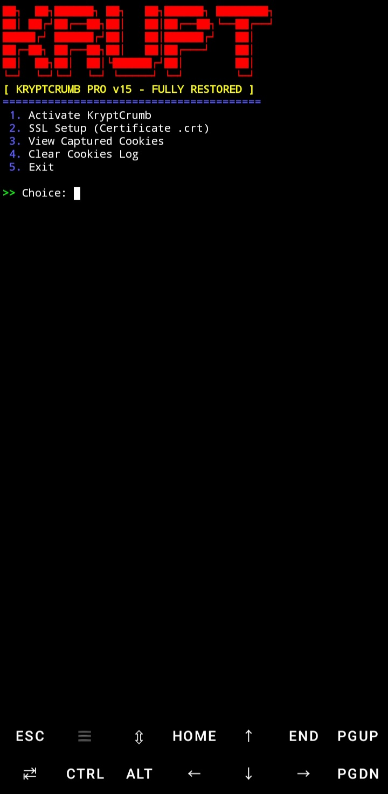

🍪 Cookie-Interceptor-in-Termux 🍪

🚀 A powerful network analysis tool designed for Termux environment.
🚀 เครื่องมือวิเคราะห์เครือข่ายประสิทธิภาพสูงที่ออกแบบมาเพื่อใช้งานบน Termux

🇹🇭 รายละเอียดภาษาไทย (Thai Description) 🇹🇭

🛠 โปรแกรมนี้ถูกพัฒนาขึ้นเพื่อใช้ในการตรวจสอบความปลอดภัยของเครือข่ายและการดักจับข้อมูลคุกกี้
👨‍💻 เหมาะสำหรับนักพัฒนาและผู้เชี่ยวชาญด้านความปลอดภัยที่ต้องการทดสอบระบบผ่านมือถือ
⚠️ คำเตือน: โปรดใช้งานเพื่อการศึกษาและความปลอดภัยส่วนบุคคลเท่านั้น

🇺🇸 English Description 🇺🇸

🛠 This tool is developed for network security auditing and cookie interception.
👨‍💻 Ideal for developers and security professionals testing systems via mobile devices.
⚠️ Warning: Please use this tool for educational and personal security purposes only.

📥 Quick Installation (คำสั่งติดตั้งอัตโนมัติ) 

💡 Copy and paste the command below to install everything and run the tool:
💡 คัดลอกและวางคำสั่งด้านล่างนี้เพื่อติดตั้งสิ่งที่จำเป็นทั้งหมดและเริ่มรันโปรแกรมทันที:

`pkg update && pkg upgrade -y && pkg install python git -y && pip install requests && python kryptcrumb_pro.py`

⚙️ System Requirements (ความต้องการของระบบ) ⚙️

📱 1. Termux application installed on Android.
📱 1. ติดตั้งแอปพลิเคชัน Termux บน Android
🐍 2. Python 3.x environment.
🐍 2. สภาพแวดล้อม Python รุ่น 3.x
🌐 3. Stable internet connection for downloading dependencies.
🌐 3. การเชื่อมต่ออินเทอร์เน็ตที่เสถียรสำหรับการดาวน์โหลดไฟล์ที่จำเป็น

🖼️ Project Screenshot Showcase
🖼️ แสดงภาพตัวอย่างการใช้งานโปรเจกต์

👑 Developer Info 👑

🎨 Created by: KING_MUSIC
🎨 สร้างโดย: KING_MUSIC
🎵 Check out my music on Spotify!
🎵 ติดตามผลงานเพลงของผมได้ที่ Spotify!
